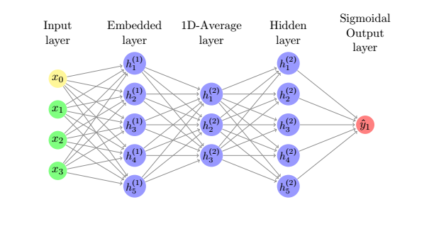

# Text Classification

## Introduction
This is a Machine learning model built using TensorFlow and Keras. When users input
a text file or a string for a review(games/movies). The model predict if the user
intended for the review to be a good or bad review.

Try it out at https://neville-loh.github.io/tf_start.html !

## Getting Started
### Online model
To Try out the model, enter any text in the text boxes up to 250 words. The longer the description the better the result.
The model will predict if you are giving a good or bad review. 

To see the value the model predicted. Right-click and inspect the element.
The value is logged in the browser console. A 1 means a very positive review, and a 0 means a very negative review.
### Running the model locally
```
# Requires the latest pip
pip install --upgrade pip

# Current stable release for CPU and GPU
pip install tensorflow

pip install numpy
```

## Result:


## Neural network design


The first input layer allows up to 250 words to be input. The data is padded to
match the input requirement if the text have less than 250 words. The input words
will be parse into a integer value that represent the words.  

The second layer is the embedded layer which build association in terms of word
vector. Each word is mapped to one vector and the vector values are learned in a way that
resembles a neural network. The batch dimension in this layer is set to 10000.


The third layer is use to concatenate the embedded layer into lower dimension so it
can be fed into the model


The output layer is chosen to be sigmodal like, this allows are prediction lies
close to either a good review or a bad review, avoiding ambiguity. The output is
between 0 and 1.


## Training the model:
